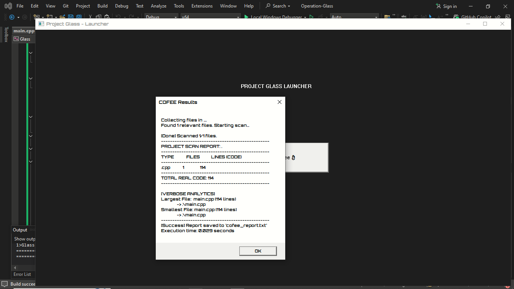

# Glass Launcher

A lightweight native Windows GUI launcher for [COFEE](https://github.com/shadowofaroman/Operation-Cofee) - the high-performance code analysis tool.



## Overview

Glass provides a clean, modern interface to run COFEE scans without touching the command line. Built with pure Win32 API in C++, it's fast, minimal, and dependency-free.

## Features

- 🎨 **Clean Dark UI** - Modern dark theme interface
- ☕ **One-Click Scanning** - Launch COFEE with a single button press
- 📊 **Output Capture** - View scan results directly in the launcher
- 🚫 **No Console Windows** - Hides command-line windows for clean execution
- ⚡ **Native Performance** - Pure C++ with Win32 API, no frameworks
- 📦 **Tiny Footprint** - Single executable, no dependencies

## Requirements

- **Windows 10 or later**
- **COFEE** installed and in the same directory (or system PATH)

## Installation

### Option 1: Download Release
1. Download the latest `glass.exe` from [Releases](https://github.com/shadowofaroman/Operation-Glass/releases)
2. Place it in the same folder as `cofee.exe`
3. Run `glass.exe`

### Option 2: Build from Source

**Prerequisites:**
- Visual Studio 2022 (with C++ development tools)
- Windows SDK

**Build Steps:**
```bash
git clone https://github.com/shadowofaroman/Operation-Glass.git
cd Operation-Glass
```

1. Open `Glass.sln` in Visual Studio
2. Select **Release** configuration
3. Build Solution (`Ctrl+Shift+B`)
4. Find executable in `x64/Release/glass.exe`

## Usage

1. **Launch Glass** - Double-click `glass.exe`
2. **Click "Launch Cofee ☕"** - Starts scanning the current directory
3. **View Results** - Scan output appears in a popup dialog

**Default COFEE flags:** `. -r -v`
- `.` = Scan current directory
- `-r` = Generate report file
- `-v` = Verbose output (detailed analytics)

## How It Works

Glass uses Windows inter-process communication (IPC) via pipes to:
1. Launch COFEE as a hidden child process
2. Capture its console output in real-time
3. Display formatted results in the GUI


## Roadmap

See [ROADMAP.md](ROADMAP.md) for planned features including:
- Browse button for selecting directories
- Progress bar during scanning
- Settings panel for configuration
- Results history tracking

## Contributing

Contributions are welcome! Please feel free to submit pull requests or open issues for bugs and feature requests.

## Related Projects

- **[COFEE](https://github.com/shadowofaroman/Operation-Cofee)** - The code analysis engine that Glass launches

## License

This project is licensed under the MIT License - see the [LICENSE](LICENSE) file for details.

## Author

**A mouse** ([@TheIndieRoman](https://x.com/TheIndieRoman))

---

*Built with C++ and Win32 API •*